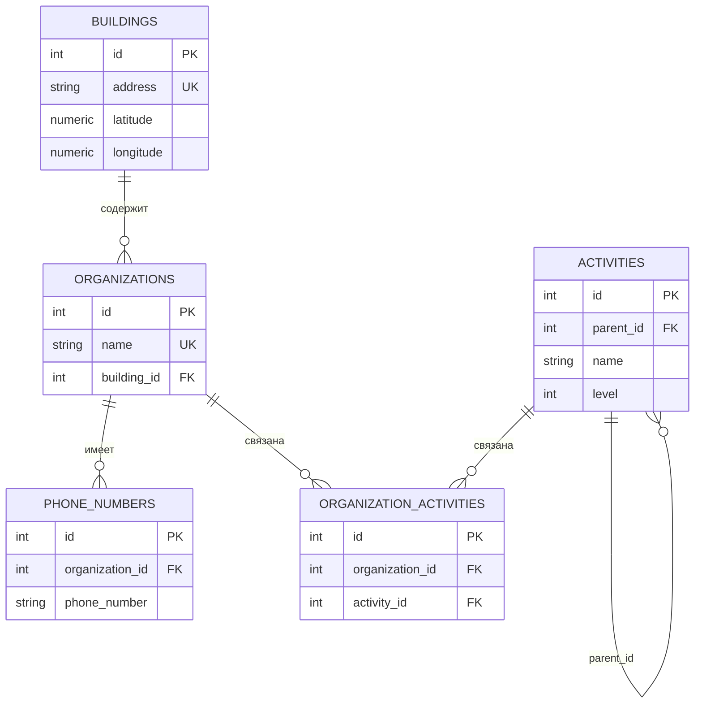

# REST API Справочник Организаций

## 📋 Описание проекта

Проект создан как тестовое задание. Представляет собой REST API приложение для справочника Организаций, Зданий и Деятельности с возможностью поиска по различным критериям, включая геолокацию.

## 🎯 Тестовое задание

### Основные сущности:

**1. Организация**
- Название (например: ООО "Рога и Копыта")
- Несколько номеров телефонов (2-222-222, 3-333-333, 8-923-666-13-13)
- Привязка к конкретному зданию (например: Блюхера, 32/1)
- Несколько видов деятельности (например: "Молочная продукция", "Мясная продукция")

**2. Здание**
- Адрес (например: г. Москва, ул. Ленина 1, офис 3)
- Географические координаты (широта и долгота)

**3. Деятельность**
- Название
- Древовидная структура с вложенностью до 3 уровней
- Пример дерева:
  ```
  - Еда
    - Мясная продукция
    - Молочная продукция
  - Автомобили
    - Грузовые
    - Легковые
    - Запчасти
    - Аксессуары
  ```

### Реализованный функционал:

✅ Список всех организаций в конкретном здании  
✅ Список организаций по виду деятельности  
✅ Поиск организаций в заданном радиусе от точки на карте  
✅ Поиск организаций в прямоугольной области на карте  
✅ Информация об организации по ID  
✅ Иерархический поиск по виду деятельности (включая вложенные)  
✅ Поиск организации по названию  
✅ Ограничение уровня вложенности деятельностей (3 уровня)  
✅ База данных с миграциями и тестовыми данными  
✅ Документация Swagger UI и ReDoc  
✅ Аутентификация через API ключ

## 🛠 Технологический стек

- **Python 3.10+**
- **FastAPI** - веб-фреймворк
- **Pydantic** - валидация данных
- **SQLAlchemy** - ORM
- **Alembic** - миграции БД
- **PostgreSQL** - база данных (asyncpg)
- **Uvicorn** - ASGI сервер

## 📊 Структура базы данных

### Диаграмма базы данных



### Модели:

**Organizations** (Организации)
```
id: Integer (PK)
name: String (Unique)
building_id: Integer (FK -> Buildings)
```

**Buildings** (Здания)
```
id: Integer (PK)
address: String (Unique)
latitude: Numeric(10, 8)
longitude: Numeric(11, 8)
```

**Activities** (Деятельности)
```
id: Integer (PK)
parent_id: Integer (FK -> Activities, nullable)
name: String
level: Integer (max: 3)
```

**PhoneNumbers** (Телефоны)
```
id: Integer (PK)
organization_id: Integer (FK -> Organizations)
phone_number: String
```

**OrganizationActivities** (Связь организаций и деятельностей)
```
id: Integer (PK)
organization_id: Integer (FK -> Organizations)
activity_id: Integer (FK -> Activities)
```

## 🚀 Установка и настройка

### 🐳 Быстрый старт с Docker (рекомендуется)

Для развертывания приложения в Docker контейнерах см. **[DOCKER_README.md](DOCKER_README.md)**

### 💻 Локальная установка

### 1. Клонирование репозитория
```bash
git clone <repository-url>
cd test_task-Secunda
```

### 2. Установка зависимостей
```bash
pip install -r requirements.txt
```

### 3. Настройка переменных окружения

Создайте файл `.env.test` в корне проекта:

```env
# Database
DATABASE_HOST=localhost
DATABASE_PORT=5432
DATABASE_USERNAME=postgres
DATABASE_PASSWORD=admin
DATABASE_NAME=test_task_secunda

# Backend
BACKEND_HOST=localhost
BACKEND_PORT=3002

# Security
API_KEY=5GICkvou7Ko1IlcILiJ3a4zoBj3jxVVOHgGzt3tIteuSmu8PZIkwD4xXKaU2HSuEh4uKJfitlRUfxgi6hZeMtyD4GzG6Z9mJhftZcFZ6Q3gZDNP6kpqgUske8Cwhtm0c
```

### 4. Создание базы данных

Создайте PostgreSQL базу данных:
```sql
CREATE DATABASE test_task_secunda;
```

### 5. Применение миграций

```bash
alembic upgrade head
```

### 6. Запуск приложения

```bash
python main.py
```

Приложение будет доступно по адресу: `http://localhost:3002`

## 📚 API Документация

После запуска приложения документация доступна по адресам:
- **Swagger UI**: http://localhost:3002/docs
- **ReDoc**: http://localhost:3002/redoc

## 🔐 Аутентификация

Все запросы к API требуют наличия заголовка `x-api-key`:

```bash
curl -H "x-api-key: 5GICkvou7Ko1IlcILiJ3a4zoBj3jxVVOHgGzt3tIteuSmu8PZIkwD4xXKaU2HSuEh4uKJfitlRUfxgi6hZeMtyD4GzG6Z9mJhftZcFZ6Q3gZDNP6kpqgUske8Cwhtm0c" http://localhost:3002/api/v1/...
```

## 📡 API Endpoints

### Тестовые данные

После применения миграций в базе будут следующие тестовые данные:

**Здания:**
- ID 1: г. Москва, ул. Тверская, д. 1
- ID 2: г. Москва, ул. Арбат, д. 10  
- ID 3: г. Санкт-Петербург, Невский пр., д. 28
- ID 4: г. Новосибирск, ул. Ленина, д. 52

**Организации:**
- ID 1: ООО "Рога и Копыта" (здание 1)
- ID 2: ООО "Мясокомбинат Московский" (здание 2)
- ID 3: ООО "Молочный завод" (здание 3)
- ID 5: ЗАО "АвтоТрейд" (здание 4)
- ID 7: ООО "IT-Решения" (здание 6)

**Деятельности:**
- ID 1: Еда (уровень 1)
- ID 4: Мясная продукция (уровень 2, родитель: Еда)
- ID 5: Молочная продукция (уровень 2, родитель: Еда)
- ID 2: Автомобили (уровень 1)
- ID 8: Легковые (уровень 2, родитель: Автомобили)

---

### 1. Получить организации по ID здания
```
GET /api/v1/get-all-organizations-by-building-id/{building_id}
```
**Пример запроса:**
```bash
# Получить все организации в здании "г. Москва, ул. Тверская, д. 1" (ID 1)
curl -H "x-api-key: 5GICkvou7Ko1IlcILiJ3a4zoBj3jxVVOHgGzt3tIteuSmu8PZIkwD4xXKaU2HSuEh4uKJfitlRUfxgi6hZeMtyD4GzG6Z9mJhftZcFZ6Q3gZDNP6kpqgUske8Cwhtm0c" \
  http://localhost:3002/api/v1/get-all-organizations-by-building-id/1
```

### 2. Получить организации по ID деятельности
```
GET /api/v1/get-all-organizations-by-activity-id/{activity_id}
```
**Пример запроса:**
```bash
# Получить все организации с деятельностью "Мясная продукция" (ID 4)
curl -H "x-api-key: 5GICkvou7Ko1IlcILiJ3a4zoBj3jxVVOHgGzt3tIteuSmu8PZIkwD4xXKaU2HSuEh4uKJfitlRUfxgi6hZeMtyD4GzG6Z9mJhftZcFZ6Q3gZDNP6kpqgUske8Cwhtm0c" \
  http://localhost:3002/api/v1/get-all-organizations-by-activity-id/4
```

### 3. Поиск организаций в радиусе
```
GET /api/v1/get-all-organizations-by-radius/
```
**Параметры:**
- `latitude` - широта центральной точки
- `longitude` - долгота центральной точки
- `radius_km` - радиус поиска в километрах

**Пример запроса:**
```bash
# Найти все организации в радиусе 5 км от центра Москвы (Красная площадь)
curl -H "x-api-key: 5GICkvou7Ko1IlcILiJ3a4zoBj3jxVVOHgGzt3tIteuSmu8PZIkwD4xXKaU2HSuEh4uKJfitlRUfxgi6hZeMtyD4GzG6Z9mJhftZcFZ6Q3gZDNP6kpqgUske8Cwhtm0c" \
  "http://localhost:3002/api/v1/get-all-organizations-by-radius/?latitude=55.7558&longitude=37.6173&radius_km=5"
```

### 4. Поиск организаций в прямоугольной области
```
GET /api/v1/get-all-organizations-by-bounding-box/
```
**Параметры:**
- `min_latitude` - минимальная широта (юг)
- `max_latitude` - максимальная широта (север)
- `min_longitude` - минимальная долгота (запад)
- `max_longitude` - максимальная долгота (восток)

**Пример запроса:**
```bash
# Найти все организации в пределах центра Москвы (прямоугольная область)
curl -H "x-api-key: 5GICkvou7Ko1IlcILiJ3a4zoBj3jxVVOHgGzt3tIteuSmu8PZIkwD4xXKaU2HSuEh4uKJfitlRUfxgi6hZeMtyD4GzG6Z9mJhftZcFZ6Q3gZDNP6kpqgUske8Cwhtm0c" \
  "http://localhost:3002/api/v1/get-all-organizations-by-bounding-box/?min_latitude=55.74&max_latitude=55.77&min_longitude=37.59&max_longitude=37.63"
```

### 5. Получить организацию по ID
```
GET /api/v1/get-organization-by-id/{organization_id}
```
**Пример запроса:**
```bash
# Получить информацию об организации "ООО Рога и Копыта" (ID 1)
curl -H "x-api-key: 5GICkvou7Ko1IlcILiJ3a4zoBj3jxVVOHgGzt3tIteuSmu8PZIkwD4xXKaU2HSuEh4uKJfitlRUfxgi6hZeMtyD4GzG6Z9mJhftZcFZ6Q3gZDNP6kpqgUske8Cwhtm0c" \
  http://localhost:3002/api/v1/get-organization-by-id/1
```

### 6. Поиск организаций по деятельности (с вложенностью)
```
GET /api/v1/search-organizations-by-activity/
```
**Параметры:**
- `activity_name` - название деятельности

При поиске по деятельности "Еда" найдутся все организации с деятельностью:
- Еда
- Мясная продукция (подкатегория Еды)
- Молочная продукция (подкатегория Еды)

**Пример запроса:**
```bash
curl -H "x-api-key: 5GICkvou7Ko1IlcILiJ3a4zoBj3jxVVOHgGzt3tIteuSmu8PZIkwD4xXKaU2HSuEh4uKJfitlRUfxgi6hZeMtyD4GzG6Z9mJhftZcFZ6Q3gZDNP6kpqgUske8Cwhtm0c" \
  "http://localhost:3002/api/v1/search-organizations-by-activity/?activity_name=Еда"
```

### 7. Поиск организаций по названию
```
GET /api/v1/search-organizations-by-name/
```
**Параметры:**
- `organization_name` - название организации (поддерживает частичное совпадение)

**Пример запроса:**
```bash
# Найти все организации, в названии которых есть слово "Авто"
curl -H "x-api-key: 5GICkvou7Ko1IlcILiJ3a4zoBj3jxVVOHgGzt3tIteuSmu8PZIkwD4xXKaU2HSuEh4uKJfitlRUfxgi6hZeMtyD4GzG6Z9mJhftZcFZ6Q3gZDNP6kpqgUske8Cwhtm0c" \
  "http://localhost:3002/api/v1/search-organizations-by-name/?organization_name=Авто"
```

## 🗄 Работа с миграциями

### Создание новой миграции
```bash
alembic revision --autogenerate -m "Описание изменений"
```

### Применение миграций
```bash
alembic upgrade head
```

### Откат миграции
```bash
alembic downgrade -1
```

### Просмотр истории миграций
```bash
alembic history
```

## 📁 Структура проекта

```
test_task-Secunda/
├── configuration/          # Настройки приложения
│   ├── base.py
│   └── config.py
├── database/              # Работа с БД
│   ├── models/           # SQLAlchemy модели
│   ├── repositories/     # Репозитории для работы с данными
│   ├── migrations/       # Alembic миграции
│   ├── base_model.py
│   ├── base_repository.py
│   └── base.py
├── utils/                # Утилиты
│   └── radius.py        # Расчет расстояний (формула Haversine)
├── web_api/             # FastAPI приложение
│   ├── dependencies/    # Зависимости (API key)
│   ├── endpoints/       # API эндпоинты
│   │   └── v1/
│   └── __init__.py
├── alembic.ini          # Конфигурация Alembic
├── main.py              # Точка входа
└── requirements.txt     # Зависимости Python
```

## 🧪 Тестирование

Для тестирования API можно использовать:
- **Swagger UI** - интерактивная документация (`/docs`)
- **Postman** - импортировать OpenAPI схему (`/openapi.json`)
- **curl** - примеры приведены выше

## 📝 Примечания

### Реализованные требования:
✅ Спроектирована БД с миграциями  
✅ Реализован весь функционал API  
✅ Добавлена документация Swagger UI и ReDoc  
✅ Ограничение уровня вложенности деятельностей (3 уровня)  
✅ Аутентификация через статический API ключ  
✅ Заполнение тестовыми данными (реализовано в файлах миграций)  
✅ Docker контейнеризация с микросервисной архитектурой ([инструкция](DOCKER_README.md))

### Возможные улучшения:
- Реализовать пагинацию для списков
- Добавить сортировку результатов
- Добавить фильтрацию по нескольким параметрам
- Реализовать CRUD операции для всех сущностей
- Добавить кэширование часто запрашиваемых данных
- Написать unit и integration тесты
